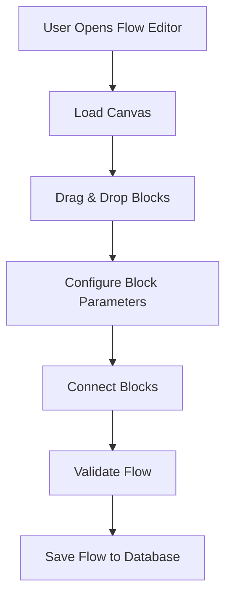
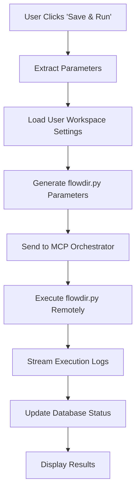

# Visual Flow Editor - Execution Architecture

## Overview

The Visual Flow Editor execution system integrates with the existing application architecture, reusing the proven MCP orchestrator pattern used by the chatbot for remote script execution.

## Architecture Components

### 1. Frontend Flow Designer
**Location**: `client/src/components/FlowEditor/`

**Responsibilities**:
- Visual canvas for flow design using React Flow
- Block configuration and parameter input
- Flow validation and preview
- Save/load flow configurations
- Real-time execution status display

### 2. Backend API Integration
**Location**: `src/routes/flows/`

**Responsibilities**:
- Flow CRUD operations
- Parameter validation and transformation
- MCP orchestrator communication
- Execution status tracking
- Database persistence

### 3. MCP Integration Layer
**Location**: `python/DIR_CREATE_MODULE/`

**Responsibilities**:
- Copy of MCP client from `python/terminal-mcp-orchestrator/`
- Flow-specific execution wrapper
- flowdir.py parameter injection
- Remote execution coordination

## Execution Flow

### Phase 1: Flow Design


### Phase 2: Flow Execution


## Parameter Mapping System

### Visual Blocks → flowdir.py Parameters

#### Input Blocks
```typescript
interface InputBlockData {
  blockType: 'project_input' | 'block_input' | 'tool_input' | 'stage_input';
  parameterName: string;
  value: string;
  validation?: {
    required: boolean;
    pattern?: string;
    options?: string[];
  };
}

// Maps to flowdir.py inputs:
const parameterMapping = {
  project_input: 'pname',           // Project name
  block_input: 'block_name',        // Block name  
  tool_input: 'tool_used',          // cadence | synopsys
  stage_input: 'stage_in_flow',     // SYNTH | PD | LEC | STA | all
  run_input: 'run',                 // Run name
  steps_input: 'steps',             // PD steps: Floorplan Place CTS Route
  ref_run_input: 'runlink'          // Reference run path
};
```

#### Process Blocks
```typescript
interface ProcessBlockData {
  blockType: 'synthesis' | 'physical_design' | 'lec' | 'sta';
  stage: string;
  dependencies: string[];           // Connected input blocks
  executionOrder: number;
}
```

#### Output Blocks
```typescript
interface OutputBlockData {
  blockType: 'directory_structure' | 'execution_script' | 'logs';
  outputPath: string;
  expectedFiles: string[];
}
```

## User Workspace Settings

### Settings Configuration
**Location**: Settings page → Workspace Configuration section

```typescript
interface WorkspaceSettings {
  work_area_location: string;       // Default: '/mnt/projects_107/vasu_backend'
  central_scripts_path: string;     // Default: '/mnt/projects/vasu_backend/flow/central_scripts'
  default_tool: 'cadence' | 'synopsys';
  default_user_name: string;
  mcp_server_preference?: string;   // Preferred MCP server for execution
}
```

### Database Storage
```sql
-- Stored per user UUID
INSERT INTO user_workspace_settings (
    user_id,
    work_area_location,
    central_scripts_path,
    default_tool,
    default_user_name
) VALUES (
    $1, $2, $3, $4, $5
) ON CONFLICT (user_id) 
DO UPDATE SET
    work_area_location = EXCLUDED.work_area_location,
    central_scripts_path = EXCLUDED.central_scripts_path,
    updated_at = CURRENT_TIMESTAMP;
```

## MCP Execution Integration

### Reusing Existing MCP Pattern

#### 1. Copy MCP Client
```bash
# Copy existing MCP orchestrator to DIR_CREATE_MODULE
cp -r python/terminal-mcp-orchestrator/* python/DIR_CREATE_MODULE/
```

#### 2. Flow Execution Wrapper
**File**: `python/DIR_CREATE_MODULE/flow_mcp_executor.py`

```python
#!/usr/bin/env python3
"""
Flow MCP Executor - Executes flowdir.py via MCP orchestrator
Reuses existing MCP client pattern from chatbot integration
"""

import sys
import json
import os
from mcp_client import MCPClient

def execute_flowdir_via_mcp(mcp_server_url, flow_parameters, workspace_settings):
    """
    Execute flowdir.py with given parameters via MCP
    
    Args:
        mcp_server_url: MCP server endpoint
        flow_parameters: Extracted from visual flow blocks
        workspace_settings: User workspace configuration
    """
    
    # Prepare flowdir.py execution command
    command = f"""
    cd {workspace_settings['work_area_location']}
    export CENTRAL_SCRIPTS_PATH="{workspace_settings['central_scripts_path']}"
    
    # Create parameter file for flowdir.py
    cat > /tmp/flow_params.json << EOF
{json.dumps(flow_parameters)}
EOF
    
    # Execute flowdir.py with parameters
    python3 flowdir.py < /tmp/flow_params.json
    """
    
    # Execute via MCP (same pattern as chatbot)
    client = MCPClient(mcp_server_url)
    client.connect()
    
    result = client.invoke_tool('runShellCommand', {
        'command': command,
        'workingDirectory': workspace_settings['work_area_location']
    })
    
    client.disconnect()
    return result
```

#### 3. Backend API Integration
**File**: `src/routes/flows/execute.js`

```javascript
// Execute flow via MCP (similar to chatbot MCP integration)
app.post('/api/flows/:flowId/execute', async (req, res) => {
  try {
    const { flowId } = req.params;
    const userId = req.user.id;
    
    // Load flow and user settings
    const flow = await getFlowById(flowId, userId);
    const workspaceSettings = await getUserWorkspaceSettings(userId);
    
    // Extract parameters from visual flow
    const flowParameters = extractParametersFromFlow(flow.canvas_data);
    
    // Get user's MCP server configuration
    const mcpConfig = await getUserMCPConfig(userId);
    
    // Execute via MCP orchestrator
    const executionResult = await executeMCPCommand({
      serverUrl: mcpConfig.server_url,
      tool: 'runShellCommand',
      parameters: {
        command: generateFlowdirCommand(flowParameters, workspaceSettings),
        workingDirectory: workspaceSettings.work_area_location
      }
    });
    
    // Store execution record
    await createFlowExecution({
      flowId,
      userId,
      status: 'running',
      parameters: flowParameters,
      mcpServer: mcpConfig.server_url
    });
    
    res.json({
      success: true,
      executionId: executionResult.id,
      status: 'started'
    });
    
  } catch (error) {
    res.status(500).json({ error: error.message });
  }
});
```

## Development Phases

### Phase 1: Frontend Development (Current Focus)
1. **React Flow Canvas**: Implement visual flow editor
2. **Block Components**: Create input, process, and output blocks
3. **Theme Integration**: Ensure Dark/Light/Midnight theme support
4. **Parameter Forms**: Block configuration interfaces
5. **Flow Validation**: Connection and parameter validation
6. **Dummy Data**: Use placeholder data for initial development

### Phase 2: Backend Integration
1. **Database Schema**: Implement flow storage tables
2. **API Endpoints**: CRUD operations for flows
3. **Settings Integration**: Workspace configuration management
4. **Parameter Extraction**: Convert visual flow to flowdir.py parameters

### Phase 3: MCP Execution
1. **MCP Client Copy**: Copy orchestrator to DIR_CREATE_MODULE
2. **Execution Wrapper**: Create flow-specific MCP executor
3. **Real-time Updates**: WebSocket for execution status
4. **Error Handling**: Comprehensive error management

### Phase 4: Production Features
1. **Flow Templates**: Pre-built flow templates
2. **Execution History**: Historical execution tracking
3. **Performance Monitoring**: Execution metrics and optimization
4. **Advanced Validation**: Complex flow validation rules

## File Structure

```
client/src/components/FlowEditor/
├── index.tsx                     # Main flow editor component
├── canvas/
│   ├── FlowCanvas.tsx           # React Flow canvas
│   ├── NodePalette.tsx          # Draggable node palette
│   └── FlowControls.tsx         # Canvas controls
├── blocks/
│   ├── InputBlock.tsx           # Input parameter blocks
│   ├── ProcessBlock.tsx         # Process execution blocks
│   └── OutputBlock.tsx          # Output result blocks
├── forms/
│   ├── BlockConfigForm.tsx      # Block parameter configuration
│   └── WorkspaceSettingsForm.tsx # Workspace settings
└── hooks/
    ├── useFlowExecution.ts      # Flow execution management
    └── useWorkspaceSettings.ts  # Workspace settings management

src/routes/flows/
├── index.js                     # Flow CRUD routes
├── execute.js                   # Flow execution endpoint
└── settings.js                  # Workspace settings routes

python/DIR_CREATE_MODULE/
├── flowdir.py                   # Original flowdir script
├── mcp_client.py               # Copied from terminal-mcp-orchestrator
├── orchestrator.py             # Copied from terminal-mcp-orchestrator
└── flow_mcp_executor.py        # New flow execution wrapper
```

This architecture ensures seamless integration with the existing application while providing a robust, scalable foundation for the Visual Flow Editor.
